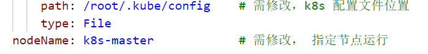
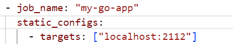

这个应用可以监控集群各个节点的 CPU 和内存使用率
部署前需要配置号 metric，即能提供命令行 kubectl top nodes 查看各个节点的使用率
同时暴露的端口是 2112，需要防止端口冲突
这个程序的通过连接主机获取客户端服务的方式获取集群信息，相当于把 kubectl top nodes 自动化

部署：
需要修改 k8s 的配置文件路径，挂载到容器中
同时指定运行节点为 promrtheus 监测的节点上
具体位置已经在 yaml 文件标出

比如；我的 prometheus 监听的端口是在 master 节点上

